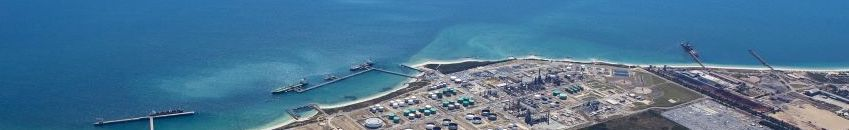

# CSIEM : The Cockburn Sound Integrated Ecosystem Model

[](https://www.repostatus.org/#active)

<br>

This is the repository for relevant **data, models and documentation** for [Cockburn Sound](https://en.wikipedia.org/wiki/Cockburn_Sound), developed as part of the [WAMSI-Westport Marine Science Program](https://wamsi.org.au/research/programs/wamsi-westport-marine-science-program/).

For an overview of the CSIEM model, refer to the [CSIEM Documentation](https://en.wikipedia.org/wiki/Cockburn_Sound).

<br>

## Repository organisation

This repository is the stable bundle including:

- The CSIEM input and configuration files, linked via `csiem-model`
- The CSIEM science documentation, linked via `csiem-science`
- The CSIEM analysis, visualisation and reporting tools, linked via `csiem-marvl`

<br>

## Cloning the repo with all submodule code/files

A basic clone will not include the code in the submodules so an extra argument is needed `--recurse-submodules`

### Cloning the latest bundle
```
git clone --recurse-submodules https://github.com/AquaticEcoDynamics/CSIEM.git
```

### Cloning a particular tag
```
git clone --recurse-submodules -b v1.1.0 https://github.com/AquaticEcoDynamics/CSIEM.git
```

<br>

## Archiving all code/files

If you want to create an archive of all the code (including the submodules), first clone the repository as described above and zip entire repository.  The zip file can be uploaded to Zenodo to get a DOI.  An automated integration with Zenodo will not archive the code from the submodules.

<br>

## Additional information

See repository Wiki for additional information on editing the repository and adding new content.

<br>


